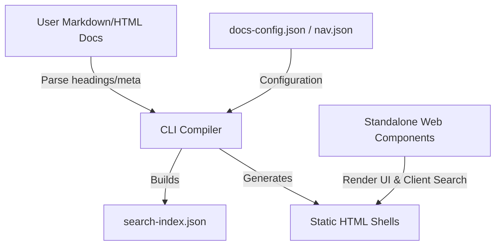

# Feasibility Report: Standalone Help Center Product

Converting the current Help Center system from this project into a standalone, portable documentation builder is **highly feasible**. The underlying architectural decisions—specifically native Web Components and static index crawling—decouple the presentation and search logic from any specific framework.

---

## Architectural Feasibility Highlights

### 1. Zero-Dependency Web Components
The frontend layout and functionality in [docs-components.js](file:///Users/ryan/Sites/iconStudio/docs/docs-components.js) are built with native Custom Elements (`<docs-header>`, `<docs-sidebar>`, `<docs-search>`, `<docs-grid>`, `<docs-anchor-helper>`). 
* **Self-Contained Icons:** SVG icons are dynamically constructed inside the file, removing Lucide or other external dependencies.
* **Asynchronous Feeds:** Dynamic assets like site navigation and search indexing are fetched from separate files (`nav.json`, `search-index.json`), separating logic from content.

### 2. Static Parsing & Client-Side Search
Rather than relying on a heavy server or databases:
* [generate-docs-index.js](file:///Users/ryan/Sites/iconStudio/scripts/generate-docs-index.js) parses raw static HTML files inside the `docs/` folder to extract page titles, descriptions, categories, and headings.
* It outputs [search-index.json](file:///Users/ryan/Sites/iconStudio/docs/search-index.json), which is consumed by `DocsSearch` in [docs-components.js](file:///Users/ryan/Sites/iconStudio/docs/docs-components.js) to execute fuzzy token-matching and Porter stemming client-side.

### 3. Config-Driven Scaffolding
The templates ([index.html](file:///Users/ryan/Sites/iconStudio/docs/index.html) and [list.html](file:///Users/ryan/Sites/iconStudio/docs/list.html)) are generated dynamically using [docs-config.json](file:///Users/ryan/Sites/iconStudio/docs/docs-config.json) via [init-docs.js](file:///Users/ryan/Sites/iconStudio/scripts/init-docs.js). This establishes a clean path to packaging.

---

## Key Refactoring & Decoupling Requirements

To package this as a standalone product, the following assets need to be decoupled from the host project:

### 1. Remove Root App Reliances
* **Global CSS Integration:** [style.css](file:///Users/ryan/Sites/iconStudio/docs/style.css) relies on the root app stylesheet (`../style.css`) for core resets and some variables. The standalone product needs its own isolated base stylesheet.
* **Host App Custom Components:** The generated templates currently reference host-specific components like `<icon-studio-footer>` (via the `PREFIX` placeholder). The standalone system should use a generic `<docs-footer>` component.
* **Root Assets:** Hardcoded links to root folders (such as `/assets/favicon/...` in templates) should be abstracted or local to the docs directory.

### 2. Standalone CLI and Package Structure
The scripts can be wrapped in an npm CLI package (e.g., `docscraft` or `static-helpdocs`):
* `init` commands to copy templates and default configs.
* `create` command to scaffold new documents.
* `build` command to regenerate the search index.

