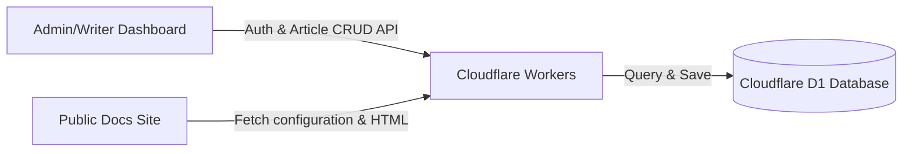

# Standalone Help Center: "Serverless Dynamic" SaaS Guide (Option B)

This guide is tuned specifically for **Option B: The "Serverless Dynamic" SaaS** as outlined in [feasibility_analysis_with_server_info.md](file:///Users/ryan/Sites/helpCenter/feasibility_analysis_with_server_info.md). It outlines the architecture, step-by-step setup in the Cloudflare Dashboard for non-developers, and the task list for implementing the CRUD API and D1 Database.

---

## 1. SaaS Architecture Overview

Instead of compiles/cli builders, Option B operates as a hosted multi-tenant database-backed web application:



* **Frontend (Cloudflare Pages):** Serves the static admin authoring interface (where you write articles) and the client-side reading shell (built from our custom elements).
* **Backend API (Cloudflare Workers):** Handles request routing, simple session token authentication, and database queries.
* **Database (Cloudflare D1):** An SQL database built on SQLite that stores settings, users, and article content.

---

## 2. Cloudflare Dashboard Setup Guide (Non-Developer Friendly)

Here is how to set up the infrastructure directly in the Cloudflare web browser dashboard.

### Step 2.1: Sign Up / Log In
1. Go to the [Cloudflare Dashboard](https://dash.cloudflare.com/).
2. Sign in or register a free account.

### Step 2.2: Create the D1 Database
*Cloudflare D1 is a serverless SQL database where all articles, categories, and configurations are stored.*
1. In the left navigation sidebar, click on **Workers & Pages**.
2. Select **D1** under the menu.
3. Click the blue **Create database** button.
4. Select **Dashboard** (instead of CLI).
5. Give your database a name (e.g., `helpdocs-db`) and click **Create**.
6. Keep the dashboard page open or note down the **Database ID** (a long alphanumeric string) which you will need for binding.
7. Read more on D1 setup at [Cloudflare D1 Get Started](https://developers.cloudflare.com/d1/get-started/).

### Step 2.3: Create the Worker (API Backend)
*The Worker runs the serverless logic to save and retrieve articles from D1.*
1. In the left navigation sidebar, click on **Workers & Pages** -> **Overview**.
2. Click **Create Application**, then click **Create Worker**.
3. Name your worker (e.g., `helpdocs-api`) and click **Deploy**.
4. Once deployed, click **Configure Worker** (or select the worker from your list and go to **Settings**).
5. Under the **Variables** tab (or **Bindings**), scroll down to **D1 Database Bindings**.
6. Click **Add binding**.
7. Enter the variable name: `DB` (this is the name the developer will reference in code).
8. Select your database (`helpdocs-db`) from the dropdown.
9. Click **Save**. This links your database to your serverless backend.
10. Read more on connecting databases to workers at [Using D1 with Workers](https://developers.cloudflare.com/d1/worker/).

### Step 2.4: Create the Pages Project (Frontend)
*Cloudflare Pages hosts the static HTML and Custom Web Components.*
1. In the left navigation sidebar, click on **Workers & Pages** -> **Overview**.
2. Click **Create Application**, then click the **Pages** tab.
3. Choose to either connect your GitHub repository (recommended for automated deployments) or **Upload assets** directly.
4. Name your project (e.g., `helpdocs-app`), set the build output directory to `docs` (or the folder where our built assets reside), and click **Deploy**.

---

## 3. Developer & Agent Implementation Tasks

Below are the engineering tasks required to build this system.

### 3.1 Schema & Migrations (D1 Database)
* [ ] **Define D1 Tables:** Create a SQL migration script defining:
  * `tenants` (id, project_name, base_url, custom_domain)
  * `articles` (id, tenant_id, title, category, excerpt, content_html, slug, last_updated)
  * `users` (id, tenant_id, email, password_hash)
* [ ] **Configure wrangler.toml:** Connect the Worker local environment with:
  ```toml
  [[d1_databases]]
  binding = "DB"
  database_name = "helpdocs-db"
  database_id = "<your-d1-database-id>"
  ```

### 3.2 Backend API Setup (Cloudflare Workers)
* [ ] **Routing Framework:** Implement API request routers in the Worker for:
  * `GET /api/docs?tenantId=...` -> returns index list of articles (replaces `search-index.json`).
  * `GET /api/docs/:slug?tenantId=...` -> returns specific article HTML content.
  * `POST /api/docs` -> creates/updates articles (replaces [add-new-doc.js](file:///Users/ryan/Sites/helpCenter/scripts/add-new-doc.js)).
* [ ] **Authentication Layer:** Implement lightweight JSON Web Token (JWT) verification for admin dashboard actions.

### 3.3 Frontend Client Updates
* [ ] **Dynamic Feed Integration:** Refactor [docs-components.js](file:///Users/ryan/Sites/helpCenter/docs/docs-components.js):
  * Replace the static JSON fetches (`fetch('search-index.json')` in lines 168 and 815) with dynamic calls to your new Worker API endpoint (`/api/docs`).
  * Ensure the custom components render matching categories dynamically from D1.
* [ ] **Admin Authoring Interface:** Create a basic dashboard page `docs/admin.html` with form elements for creating and editing articles directly via the API.
